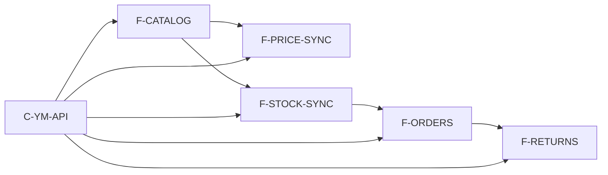

# Граф проекта — вид для человека

Канон: [graph.yaml](graph.yaml). Схема: [schema.md](schema.md).  
Инициатива: [INI-36](https://tracker.yandex.ru/INI-36). Проект: [747](https://tracker.yandex.ru/pages/projects/747).

## Позвоночник (волна 1)

```text
Каталог/оффер → Цены → Остатки → Заказы FBS → Возвраты FBS
         └────────────── C-YM-API ──────────────┘
```

Уточняется после `research/briefs/reality-brief.md`.

## Волны

| ID | Название | Статус |
|----|----------|--------|
| W1-FOUNDATION | Волна 1 charter — FBS e2e | planned |
| W2-CORE | После волны 1 (отчёты WA и др.) | planned |
| W3-EXCEPTIONS | Позже (FBO/DBS, взаиморасчёты, претензии сверх возврата) | planned |

## Фичи (слой 1)

| ID | Title | Wave | depends_on | Tracker |
|----|-------|------|------------|---------|
| F-CATALOG | Каталог / маппинг | W1 | C-YM-API | [DEVEL-2601](https://tracker.yandex.ru/DEVEL-2601) |
| F-PRICE-SYNC | Цены | W1 | C-YM-API, F-CATALOG | [DEVEL-2600](https://tracker.yandex.ru/DEVEL-2600) |
| F-STOCK-SYNC | Остатки | W1 | C-YM-API, F-CATALOG | [DEVEL-2599](https://tracker.yandex.ru/DEVEL-2599) |
| F-ORDERS | Заказы FBS | W1 | C-YM-API, F-STOCK-SYNC | ещё нет (после PRD) |
| F-RETURNS | Возвраты клиента FBS | W1 | F-ORDERS | ещё нет (после PRD) |

## Mermaid



Все пять фич — **W1**. W3 больше не про возвраты.

## Blast radius — как считать

1. Меняете `R-*` / `D-*` / `shares_*` у фичи в `graph.yaml`.
2. Собираете все узлы с ребром на этот id.
3. Патчите только их Feature PRD в `features/`.

## Views

Подграфы по волнам — в [views/](views/) (по мере появления).
