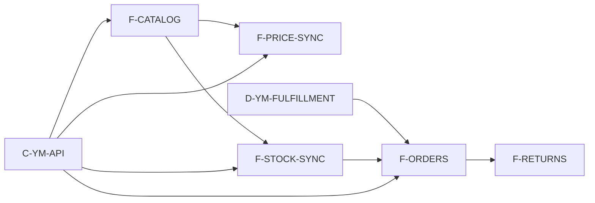

# Граф проекта — вид для человека

Канон: [graph.yaml](graph.yaml). Схема: [schema.md](schema.md).

## Позвоночник (черновик)

```text
Каталог/оффер → Цены → Остатки → Заказы → (Возвраты)
         └────────── C-YM-API ──────────┘
```

Прогон FBS: [../research/briefs/fbs-test-2026-09-01.md](../research/briefs/fbs-test-2026-09-01.md).  
Витрина Postman 2026-09-02: [../research/briefs/postman-catalog-checklist.md](../research/briefs/postman-catalog-checklist.md).

## Волны

| ID | Название | Статус |
|----|----------|--------|
| W1-FOUNDATION | Foundation | planned |
| W2-CORE | Core | planned |
| W3-EXCEPTIONS | Exceptions | planned |

## Фичи (слой 1)

| ID | Title | Wave | depends_on |
|----|-------|------|------------|
| F-CATALOG | Каталог / маппинг (**specified**, Postman 2026-09-02) | W1 | C-YM-API |
| F-PRICE-SYNC | Цены (**specified**, только business-URL) | W2 | C-YM-API, F-CATALOG |
| F-STOCK-SYNC | Остатки (**specified**, PUT + свежий updatedAt) | W2 | C-YM-API, F-CATALOG |
| F-ORDERS | Заказы (**specified**, sandbox 2026-09-01) | W2 | C-YM-API, F-STOCK-SYNC, D-YM-FULFILLMENT |
| F-RETURNS | Возвраты | W3 | F-ORDERS |

## Mermaid



## Blast radius — как считать

1. Меняете `R-*` / `D-*` / `shares_*` у фичи в `graph.yaml`.
2. Собираете все узлы с ребром на этот id.
3. Патчите только их Feature PRD в `features/`.

## Views

Подграфы по волнам — в [views/](views/) (по мере появления).
