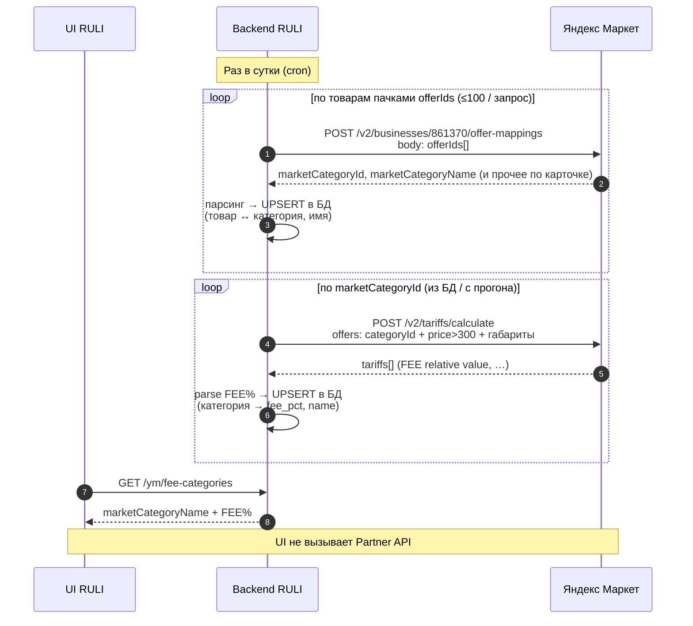
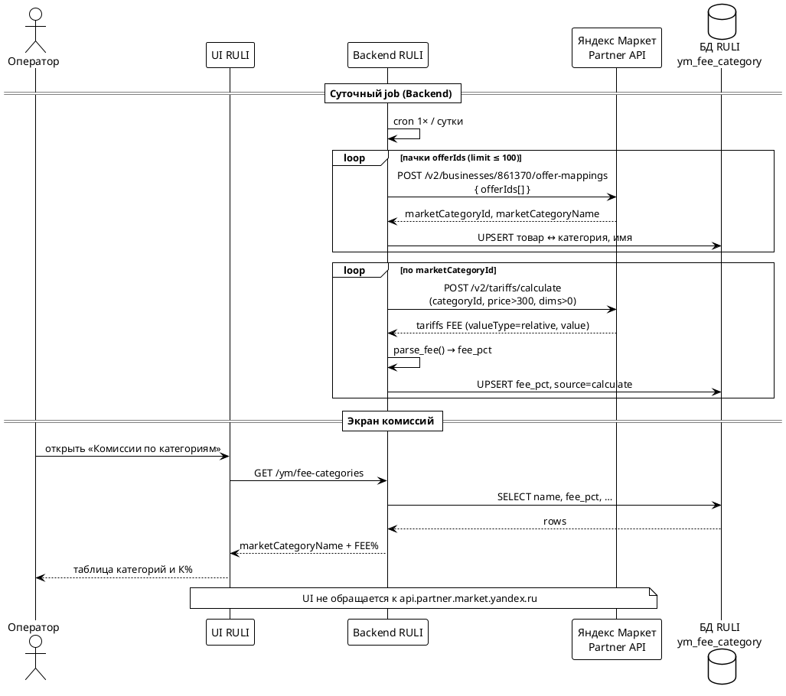
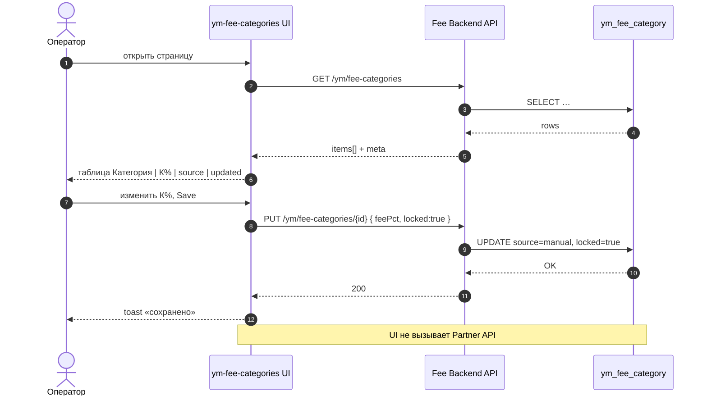
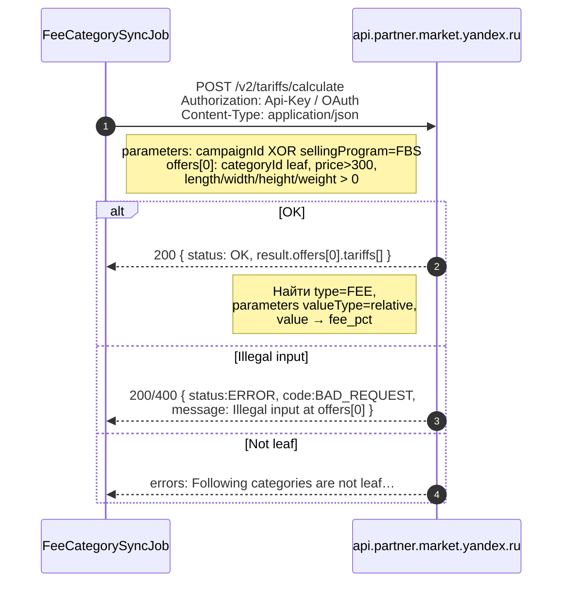
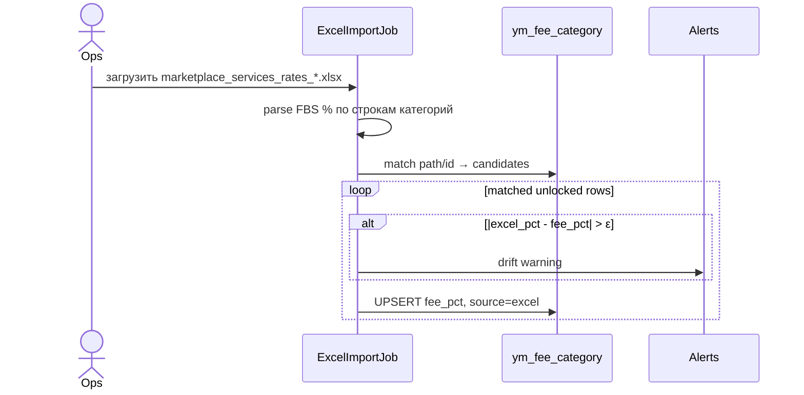

# ТЗ: получение FEE по API, парсинг и страница «Комиссии по категориям»

**Статус:** draft для разработки  
**Дата:** 2026-09-11  
**Заказчик смысла:** ценообразование ЯМ ([D-YM-PRICE-MGMT](../../decisions/D-YM-PRICE-MGMT.md))  
**UI-mock:** [page/ym-fee-categories.html](page/ym-fee-categories.html)  
**Аналитика sync:** [ym-fee-daily-sync.md](ym-fee-daily-sync.md)  
**Тарифы:** [ym-fbs-pricing.md](ym-fbs-pricing.md) · evidence [partner-api-profit.md](../evidence/external/partner-api-profit.md)  
**Открытый вопрос:** [Q-016](open-questions.md)

Документ — **техническое задание** (процессы + контракты + UML sequence). Не Feature PRD целиком и не замена Excel как юридического SoT.

---

## 0. Цель и границы

### Цель

1. **Автоматически** получать процент размещения (**FEE / fee% / К%**) по leaf-категориям ассортимента ЯМ через Partner API.  
2. **Парсить** ответ API в нормализованный справочник.  
3. **Отдавать** справочник на страницу «Комиссии по категориям» и в расчёт P_min.  
4. Опционально: **парсить Excel** прейскуранта при смене ставок (ops), с приоритетом над зондом при конфликте.

### In scope

- Job 1×/сутки: distinct leaf → `POST /v2/tariffs/calculate` → upsert.  
- Парсер `tariffs[]` → `fee_pct`.  
- Backend API для UI (GET/PUT).  
- Правила валидации запроса/ответа Partner API.  
- Ручная блокировка строки (`locked`).

### Out of scope

- Полный дамп всех категорий Маркета через API.  
- Вызов Partner API из браузера.  
- Расчёт LAST/MID/SORT/AGENCY на этой странице (только FEE%).  
- Замена `F-PRICE-SYNC` / выгрузки цен.

### Кабинет (тестовый контур)

| Параметр | Значение |
|----------|----------|
| businessId | `861370` |
| campaignId (FBS) | `137514772` |
| Доказанный leaf | `13477846` → FEE **46.00%** при P=755 |

---

## 1. Роли и системы

| Участник | Роль |
|----------|------|
| Scheduler | Запуск job раз в сутки |
| FeeCategorySyncJob | Оркестрация, retry, метрики |
| AssortmentSource | Distinct `market_category_id` (+ имя) из карточек |
| Yandex Partner API | `tariffs/calculate`, опционально `categories/tree`, `offer-mappings` |
| FeeStore (`ym_fee_category`) | SoT операционного справочника UI |
| Fee Backend API | Контракт для страницы комиссий |
| Fee Categories UI | Таблица категория → К% |
| Ops (человек) | Импорт Excel при смене прейскуранта |
| Price engine | Читает `fee_pct` для P_min |

---

## 2. Описание процессов

### P1 — Суточное получение FEE по API (основной)

**Триггер:** cron (рекомендуемо вне пика, напр. 03:00 Europe/Moscow).  
**Частота:** 1 раз в сутки (допуск ±1 ч).  
**Идемпотентность:** повторный прогон в тот же день безопасен (upsert).

```text
1. Собрать множество L = distinct leaf categoryId из ассортимента ЯМ
   (карточки business / offer-mappings / локальный каталог ym — один выбранный SoT ассортимента).
2. Для каждого id ∈ L:
   2.1. Прочитать строку Store; если locked=true → SKIP.
   2.2. Собрать тело зонда (см. §3) и вызвать POST /v2/tariffs/calculate.
   2.3. Распарсить ответ (§4): извлечь fee_pct.
   2.4. При успехе: UPSERT fee_pct, source=calculate, updated_at=now,
        last_seen_at=now, last_error=null, probe_* = параметры зонда.
   2.5. При ошибке: не затирать fee_pct; last_error=…; retry с backoff (до N раз);
        после исчерпания — метрика fail, строка может стать stale.
3. Для id, которые были в Store, но не встретились в L N дней подряд — пометить stale/orphan (не удалять сразу).
4. Записать run-метрики: total, ok, fail, changed, skipped_locked.
```

### P2 — Обогащение имени категории

**Когда:** новый leaf без `name`/`category_path`.  
**Как:**

- Предпочтительно: имя из `offer-mappings` / карточки (`marketCategoryName` или path, если есть в ответе).  
- Иначе: `POST /v2/categories/tree` — найти узел по id, собрать path до корня.  
**Не** вызывать tree на каждый leaf каждый день — только для missing names (кэш дерева на прогон допустим).

### P3 — Парсинг Excel (вспомогательный, ops)

**Триггер:** выложен новый файл `marketplace_services_rates_*.xlsx` / анонс Help.  
**Шаги:** сопоставить строку Excel (FBS %) с `market_category_id` / path → upsert `source=excel`, при конфликте с calculate — **excel wins**, если `|Δ| > ε` (по умолчанию ε=0.05 п.п.) — алерт.  
Locked-строки Excel **не** перетирает (или перетирает только после confirm — зафиксировать в реализации; по умолчанию **не трогать locked**).

### P4 — Отображение и правка на странице комиссий

**Триггер:** открытие UI / Save.  

```text
Открытие:
  UI → GET /internal/ym/fee-categories → таблица (name, fee_pct, source, updated_at, locked)

Редактирование % + Save:
  UI → PUT /internal/ym/fee-categories/{market_category_id}
       body: { fee_pct, locked: true }
  → source=manual, locked=true

Добавление категории:
  только с известным market_category_id (поиск по SKU/дереву);
  запрет строки «только имя без id».
```

Браузер **никогда** не ходит в `api.partner.market.yandex.ru`.

---

## 3. Требования к запросу Partner API (`calculate`)

### 3.1 Endpoint

| | |
|--|--|
| Method | `POST` |
| URL | `https://api.partner.market.yandex.ru/v2/tariffs/calculate` |
| Content-Type | `application/json` |
| Auth | Api-Key **или** OAuth профиля кабинета (как в Postman профиля 17) |
| Скоупы Api-Key | `pricing` / `pricing:read-only` / `all-methods` (уточнить по кабинету; не finance-only) |
| Лимит | **100 запросов/мин** (дока) → в job держать ≤ **90**/мин |

Секреты — только `secrets/` / env; не в git, не в UI, не в логах целиком.

### 3.2 Тело запроса — обязательные правила

**`parameters` (required object)** — ровно один из режимов:

| Режим | Поля | Запрет |
|-------|------|--------|
| A — магазин | `campaignId`: integer (FBS, напр. `137514772`) | Не передавать `sellingProgram` |
| B — программа | `sellingProgram`: `"FBS"` | Не передавать `campaignId` |

Опционально в `parameters` (если понадобится сверка перевода): `frequency`, `paymentDelayWeeks`, `currency` (`RUR`). Для справочника **FEE%** достаточно A или B; частота выплат на FEE не влияет.

**`offers` (required array)** — min 1, max 200 элементов.

Каждый элемент — **все** поля ниже **строго > 0** (`exclusiveMinimum` в схеме API). Ноль или отсутствие → `BAD_REQUEST` / `Illegal input at offers[0]`.

| Поле | Тип | Обязательно | Требование | Зонд (рекомендуемый конфиг) |
|------|-----|-------------|------------|------------------------------|
| `categoryId` | integer | да | **Leaf** категории Маркета; `> 0` | Из ассортимента |
| `price` | number | да | `> 0`; для FEE% справочника **`> 300`** | `1000` (вне CHEAP 42%) |
| `length` | number | да | см, `> 0` | `20` |
| `width` | number | да | см, `> 0` | `20` |
| `height` | number | да | см, `> 0` | `5` |
| `weight` | number | да | кг, `> 0` | `0.3` |
| `quantity` | integer | нет | ≥ 1, default 1 | `1` |

**Запрещено в зонде:**

- `price ≤ 300` при объёме ≤ 5 л — риск ветки **CHEAP 42%** вместо категории.  
- Не-leaf `categoryId` — ошибка вида «not leaf categories» (не путать с Illegal input).  
- Строки вместо чисел (`"755"`) — риск Illegal input.  
- Оба `campaignId` и `sellingProgram` сразу.

### 3.3 Пример валидного запроса (доказанный контур)

```json
{
  "parameters": {
    "sellingProgram": "FBS"
  },
  "offers": [
    {
      "categoryId": 13477846,
      "price": 1000,
      "length": 20,
      "width": 20,
      "height": 5,
      "weight": 0.3,
      "quantity": 1
    }
  ]
}
```

Батч: до 200 `offers` в одном запросе **допустимо** схемой; для изоляции ошибок и простого mapping «порядок запрос = порядок ответ» — начинать с **1 offer / request**, при необходимости укрупнить батч после стабилизации.

### 3.4 Ожидаемый успешный ответ (контракт для парсера)

HTTP **200**, тело:

```json
{
  "status": "OK",
  "result": {
    "offers": [
      {
        "offer": { "categoryId": 13477846, "price": 1000, "...": "..." },
        "tariffs": [
          {
            "type": "FEE",
            "amount": 460.0,
            "currency": "RUR",
            "parameters": [
              { "name": "value", "value": "46.00" },
              { "name": "billingUnit", "value": "item" },
              { "name": "valueType", "value": "relative" },
              { "name": "priceDependence", "value": "NOT_DEPENDED" },
              { "name": "priceFrom", "value": "0.00" }
            ]
          }
        ]
      }
    ]
  }
}
```

Порядок `result.offers[i]` соответствует `request.offers[i]`.

В `tariffs` также могут быть `AGENCY_COMMISSION`, несколько `PAYMENT_TRANSFER`, `DELIVERY_TO_CUSTOMER`, `MIDDLE_MILE`, иногда др. **Для этой задачи игнорировать всё, кроме FEE.**

### 3.5 Ошибки запроса (обязательная обработка)

| Ситуация | Типичный ответ | Действие job |
|----------|----------------|--------------|
| Нулевые/невалидные поля offers | `status=ERROR`, `BAD_REQUEST`, `Illegal input at offers[n]` | Не retry без фикса тела; алерт конфиг |
| Не leaf category | сообщение про leaf categories | Пометить id invalid; не писать % |
| 401/403 | auth/scope | Стоп job; алерт секретов/скоупов |
| 429 / лимит | rate limit | Backoff, снизить RPS |
| 5xx / сеть | — | Retry с jitter; сохранить старый % |
| `status=OK`, но нет FEE relative | — | Считать fail парсинга; не затирать % |

---

## 4. Алгоритм парсинга ответа → строка справочника

Вход: один элемент `result.offers[i]`.  
Выход: `{ market_category_id, fee_pct }` или ошибка парсинга.

```text
FUNCTION parse_fee(offer_result):
  tariffs ← offer_result.tariffs
  IF tariffs is empty → FAIL "no tariffs"

  fee_items ← filter tariffs WHERE type == "FEE"
  IF fee_items empty → FAIL "no FEE"

  // Предпочтение: relative ставка категории
  FOR t IN fee_items:
    params ← map name→value from t.parameters
    IF params["valueType"] == "relative" AND params["value"] is numeric:
      fee_pct ← Number(params["value"])   // "46.00" → 46.00
      // опционально сверить: amount ≈ price * fee_pct / 100
      RETURN success(fee_pct, raw=t)

  // Fallback (нежелателен для справочника К%):
  IF единственный FEE с valueType=absolute AND price>0:
    fee_pct ← round(100 * amount / price, 2)
    RETURN success(fee_pct, derived=true)  // пометить derived

  FAIL "FEE without relative value"
```

**Инварианты после парсинга:**

- `0 < fee_pct ≤ 100` (иначе FAIL).  
- Для контроля: при relative `|amount - price * fee_pct/100| ≤ 0.05 ₽` (допуск округления) — иначе warning в лог, % всё равно принять если valueType=relative.

**Доказанный эталон:** categoryId `13477846`, price `755` → value `46.00`, amount `347.3` (= 755×0.46).

### 4.1 Что не парсить на эту страницу

Не складывать в справочник комиссий категории: LAST, MID, SORTING, AGENCY, PAYMENT_TRANSFER, CHEAP-пакет. Они живут в других настройках ценообразования.

---

## 5. Модель хранения

Таблица / сущность **`ym_fee_category`** (имя уточняемо):

| Поле | Тип | Описание |
|------|-----|----------|
| `market_category_id` | bigint PK | Leaf ЯМ |
| `name` | string | Отображаемое имя / short |
| `category_path` | string null | Полный path |
| `fee_pct` | decimal(5,2) | К% |
| `selling_program` | string | `FBS` |
| `source` | enum | `calculate` \| `excel` \| `manual` |
| `locked` | bool | Job/excel не перетирают |
| `probe_price` | decimal | Цена последнего зонда |
| `probe_dims` | json null | length/width/height/weight |
| `updated_at` | timestamptz | Последний успешный upsert % |
| `last_seen_at` | timestamptz | Последнее появление leaf в ассортименте |
| `last_error` | text null | Последняя ошибка зонда/парсинга |
| `stale` | bool | N дней без успешного обновления |

Индекс: `(locked)`, `(stale)`, `(updated_at)`.

---

## 6. Внутренний API для UI (для разработчика фронта/бэка)

Базовый префикс условный: `/ym/…` в WA или соседнем сервисе.

### `GET /ym/fee-categories`

Ответ 200:

```json
{
  "items": [
    {
      "marketCategoryId": 13477846,
      "name": "Салонные фильтры",
      "categoryPath": "Запчасти / Фильтры / Салонные фильтры",
      "feePct": 46.0,
      "source": "calculate",
      "locked": false,
      "updatedAt": "2026-09-11T03:12:00+05:00",
      "stale": false
    }
  ],
  "meta": {
    "lastJobAt": "2026-09-11T03:15:00+05:00",
    "lastJobOk": 120,
    "lastJobFail": 2
  }
}
```

### `PUT /ym/fee-categories/{marketCategoryId}`

Тело:

```json
{ "feePct": 46.5, "locked": true, "name": "Салонные фильтры" }
```

Эффект: `source=manual`, `locked=true` (если locked не передан явно — при ручном изменении % ставить `locked=true`).

### `POST /ym/fee-categories` (добавление)

Тело обязательно содержит `marketCategoryId`. Опционально сразу дернуть calculate для id.

### UI-маппинг mock → продукт

| Mock HTML | Продукт |
|-----------|---------|
| `state.fees[].name` | `name` |
| `state.fees[].pct` | `feePct` |
| Save toast | `PUT` + toast по статусу |
| + категория | `POST` с id, не свободная строка |

---

## 7. UML — схемы последовательности

### 7.1 Sequence: суточный контур UI RULI ↔ Backend RULI ↔ ЯМ

**Участники:** UI RULI · Backend RULI · Яндекс Маркет (Partner API).

**Процесс (как согласовано):**

1. Раз в сутки Backend RULI по каждому товару (пачками `offerIds`) вызывает  
   `POST https://api.partner.market.yandex.ru/v2/businesses/861370/offer-mappings`,  
   забирает `marketCategoryId` + `marketCategoryName`, парсит и пишет в БД.
2. По полученным `marketCategoryId` Backend вызывает  
   `POST https://api.partner.market.yandex.ru/v2/tariffs/calculate`  
   с целью получения **FEE%**, парсит и пишет в БД.
3. UI RULI читает из Backend уже готовые **marketCategoryName** и **FEE** (не ходит в ЯМ напрямую).



#### PlantUML (тот же сценарий)



#### Оценка процесса

| Критерий | Оценка | Комментарий |
|----------|--------|-------------|
| Понятность для бизнеса | **Хорошо** | Три шага: узнать категорию товара → узнать % комиссии → показать на экране |
| Корректность FEE% | **Хорошо** | FEE берётся с leaf-категории карточки ЯМ, не «средний авто»; эталон 13477846 → 46% |
| Разделение UI / ЯМ | **Хорошо** | Токены и лимиты Маркета только на Backend |
| Нагрузка `offer-mappings` | **Тяжело на большом каталоге** | 1 млн SKU ≈ 10 000 запросов; без подписки ~1 ч 40 мин «в потолок», с Medium ~17 мин (+ запас на 429) |
| Нагрузка `tariffs/calculate` | **Риск перерасхода, если звать по каждому SKU** | FEE% одинаков для одной категории. Если 1 млн товаров и ~500 уникальных категорий — достаточно **~500** calculate, не миллиона. **Рекомендация:** после mappings делать **distinct `marketCategoryId`**, затем calculate только по уникальным (и skip `locked`) |
| Свежесть для UI | **Достаточно** | 1×/сутки ок для справочника К%; UI всегда читает БД |
| Устойчивость | **Нужны правила** | При ошибке ЯМ не затирать старый FEE%; retry на 429/5xx; не retry слепо на Illegal input |
| Итог | **Рабочий контур, с обязательной оптимизацией** | Оставить обход товаров для имён/привязки категорий; **FEE считать по уникальным категориям**. Иначе суточный job на миллионе SKU упрётся в лимиты calculate (100 req/min) на многие часы/дни |

**Вердикт:** процесс как схема «Backend раз в сутки тянет категории с карточек → тянет FEE → UI читает БД» — **принимаем**. Обязательное уточнение к реализации: шаг calculate — **по уникальным `marketCategoryId`**, а не «calculate на каждый offerId».

### 7.2 Sequence: страница комиссий (чтение + ручное сохранение)



### 7.3 Sequence: один зонд calculate (детальный контракт)



### 7.4 Sequence: ops-импорт Excel (опционально)



---

## 8. NFR и эксплуатация

| Требование | Значение |
|------------|----------|
| Частота job | 1×/сутки |
| RPS к calculate | ≤ 90/min |
| Timeout HTTP | 15–30 s |
| Retry | ≤ 3 на 429/5xx; **0** слепых retry на Illegal input |
| Probe price | конфиг, default `1000`, **> 300** |
| Идемпотентность | upsert по `market_category_id` |
| Секреты | env / secrets; маскирование в логах |
| Наблюдаемость | счётчики ok/fail/changed/locked; алерт fail_rate > порога |
| Совместимость UI | заменить mock в `ym-fee-categories.html` без смены UX-колонок «Категория / К%» |

---

## 9. Критерии приёмки (AC)

1. **Happy path:** для leaf `13477846` job записывает `fee_pct=46.00` (±0.01) при валидном токене.  
2. **Парсинг:** из полного ответа с FEE+AGENCY+PAYMENT_TRANSFER+… в Store попадает только FEE relative.  
3. **Illegal input:** при `price=0` job не портит существующий %, пишет `last_error`.  
4. **Locked:** ручной Save на UI → следующий daily job не меняет `fee_pct`.  
5. **UI:** GET отдаёт все unlocked+locked строки; страница не содержит Partner token.  
6. **CHEAP-защита:** конфиг зонда с `price ≤ 300` запрещён валидатором job (fail-fast).  
7. **XOR parameters:** тест на тело с обоими `campaignId` и `sellingProgram` — job не отправляет такое.  
8. **Лимит:** при 100+ leaf паузы соблюдают ≤90 req/min (интеграционный/нагрузочный смоук).

---

## 10. Задачи разработки (нарезка)

| # | Задача | Результат |
|---|--------|-----------|
| T1 | Миграция `ym_fee_category` | таблица + индексы |
| T2 | Клиент Partner `calculate` + валидатор тела | unit-тесты на XOR и >0 |
| T3 | `parse_fee` | unit-тесты на эталон 13477846 / 46% |
| T4 | FeeCategorySyncJob + cron | метрики, retry |
| T5 | AssortmentSource distinct leaf | интеграция с ym-каталогом |
| T6 | GET/PUT `/ym/fee-categories` | контракт §6 |
| T7 | Подключить UI вместо mock | page → API |
| T8 (ops) | Excel import | P3, после T1 |

---

## 11. Ссылки

- Дока: [calculateTariffs](https://yandex.ru/dev/market/partner-api/doc/ru/reference/tariffs/calculateTariffs)  
- Ошибки тарифов: [error-codes § tariffs](https://yandex.ru/dev/market/partner-api/doc/ru/concepts/error-codes)  
- Размещение (Excel SoT): [Help · placement](https://yandex.ru/support/marketplace/ru/introduction/rates/placement)
